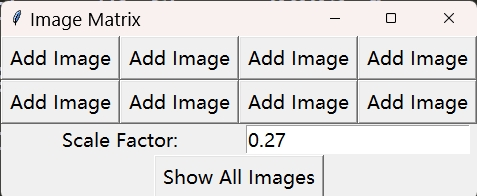

# auto-app
auto-app中包含了一些自动化运行项目代码的Python类。

1. `Utils/AutoRun.py`中的 `Auto_Run`类是一个可以自动化运行某个文件夹下的单个或多个`.py`文件，下面这段代码可以自动运行文件夹`UMAP/Basic`在的所有`.py`文件，并通过文件`Make_Results_UMAP.py`整理实验结果。
```python
from Utils import Auto_Run
AR = Auto_Run(
    Project="UMAP",  # 项目名称
    MRPY="Make_Results_UMAP.py", # 整理实验结果的专门文件
    content="UMAP/Basic", # 存储代码文件的位置
    is_parallel=False, # 不并行运行
    lock=True #不发送邮件提醒
)
AR.Run()
```
2. `Utils/Figures.py`中包含了一些转换图像格式的Python函数

3. `Utils/ImageMatrix.py`中的`Image_Matrix`类是一个展示图像矩阵的的Python类，可以按照如下形式进行调用：
```python
from Utils import Image_Matrix
Image_Matrix(2, 4)
```
上面的代码可以得到下图中的应用，可以通过`Add Image`按钮添加图像并通过`Show All Images`按钮进行统一展示。`Scale Factor`是一个自动确定的缩放因子。



4. `Utils/Make_Results.py`中中的`Make_Results`类可以自动化整理`test_utils/Analysis`中的实验结果
```python
from Utils import Make_Results
from Utils import Make_Table
import os
MR = Make_Results(
    project='UMAP',
    index=["PRE", 'REC'],
    methods=["PUMAP", "UMAP", "KUMAP"],
    datasets=["CMNIST", "TMNIST"]
)
MR.make()
MT = Make_Table()
xlsx_list = [item for item in os.listdir(MR.result_file) if item.endswith(".xlsx")]
for xlsx in xlsx_list:
    MT.Make(os.path.join(MR.result_file, xlsx))
```

5. `Utils/MakeTable.py`中包含了一个自动化制作三线表的Python类，主要功能如下：
- 制作三线表；
- 加粗第一行和第一列；
- 加粗每一列的最大值；
- 设置字体为Times New Roman；
- 以4位小数显示数字；

可以通过下面的代码进行自动排版：
```python
from Utils import Make_Table
m = ["GLPP", "GKDA"]
MT = Make_Table(methods=m)
MT.Make("ACC.xlsx")
```
6. `Send/SendMail.py`文件中的`Auto_Email`类可以自动在实验过程中发送开始或结束通知
7. `Send/utils.py`文件中的`check_Internet`函数可以检查当前设备的网络状态
8. 可以在`Send/config.py`文件中设置发送和接收通知的邮箱号
```python
from Send import Auto_Email
from Send import check_Internet
if check_Internet(lock=False):
    AS = Auto_Email(subject="项目开始通知")
    # AS.Send_txt(txt="项目开始运行！")
```
9. `test_utils/test_utils.ipynb`文件展示了一些案例
